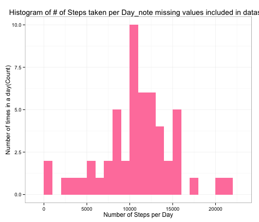
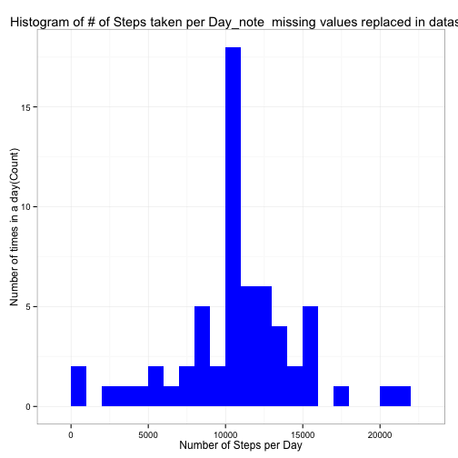
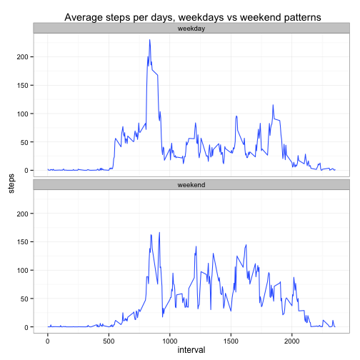

<h1>Peer Assessment 1-Reproducible Research</h1>
<h2>Author: Sharon Flynn</h2>
========================================================
<h3>Loading and preprocessing the data</h3>
**Full data and project details can be is found at [link](https://github.com/rdpeng/RepData_PeerAssessment1/blob/master/README.md)**

```r
echo = TRUE
if(!file.exists("getdata-projectfiles-UCI HAR Dataset.zip")) {
        temp <- tempfile()
        download.file("http://d396qusza40orc.cloudfront.net/repdata%2Fdata%2Factivity.zip",temp)
        unzip(temp)
        unlink(temp)
}
data <- read.csv("activity.csv")
## Fix date to reflect date values not factors
newdate  <-  as.Date(data$date, "%Y-%m-%d") ## Create date value field 
data$newdate  <- newdate
## Sum steps in 24 hour day
steps_by_day <- aggregate(steps ~ newdate, data=data, FUN=sum)
require(ggplot2)
```

```
## Loading required package: ggplot2
```

<h3>Question 1: What is mean total number of steps taken per day?  </h3>
For this part of the assignment, you can ignore the missing values in the dataset.  
1. Calculate the total number of steps taken per day  
2. Make a histogram of the total number of steps taken each day  
3. Calculate and report the mean and median of the total number of steps taken per day  

```r
sum(steps_by_day$steps)
```

```
## [1] 570608
```

```r
mean(steps_by_day$steps)
```

```
## [1] 10766
```

```r
median(steps_by_day$steps)
```

```
## [1] 10765
```
1. Total steps per day is 570,608  
2. Mean number of steps per day is 10,766.19  
3. Median number of steps per day is 10,765    
For this part of the assignment, you can ignore the missing values in the dataset*  
<h3>Make a histogram of the total number of steps taken each day  </h3>

```r
ggplot(steps_by_day, aes(x = steps)) + 
       geom_histogram(fill = "palevioletred1", binwidth = 1000) + 
        labs(title="Histogram of # of Steps taken per Day_note missing values included in dataset", 
             x = "Number of Steps per Day", y = "Number of times in a day(Count)") + theme_bw() 
```

 
1. What is the average daily activity pattern?  
<h3>Make a time series plot (i.e. type = "l") of the 5-minute interval (x-axis) and the average number of steps taken, averaged across all days (y-axis)  </h3>  

```r
#Create line chart
steps_by_interval_avg <- aggregate(steps ~ interval, data=data, FUN=mean)
 plot (x= steps_by_interval_avg$interval, y= steps_by_interval_avg$steps ,type ="l",
       xlab ="5 minute intervals",
       ylab = "Average Number of steps")
```

 

Which 5-minute interval, on average across all the days in the dataset, contains the maximum number of steps?  
**Interval 104**

```r
max_steps <- steps_by_interval_avg[which.max(steps_by_interval_avg$steps),]
```
**Imputing missing values**  
_*Note that there are a number of days/intervals where there are missing values (coded as NA). The presence of missing days may introduce bias into some calculations or summaries of the data.*_  
_Calculate and report the total number of missing values in the dataset (i.e. the total number of rows with NAs)._

```r
## calculate missing values
missing_values <- sum(is.na(data$steps))
missing_values
```

```
## [1] 2304
```
*There are 2304 missing values*
<h3>Devise a strategy for filling in all of the missing values in the dataset. The strategy does not need to be sophisticated. For example, you could use the mean or median for that day, or the mean for that 5-minute interval, etc.</h3>  
Create a function na.fix(datana, eachinterval)where the fuction datana is the orginal dataframe with na and eachinterval is the steps_by_interval_avg  


```r
na_fix <- function(datana, eachinterval) {
        na_id<- which(is.na(data$steps))
        na_replace <- unlist(lapply(na_id, FUN=function(idx){
                interval = data[idx,]$interval
                eachinterval[eachinterval$interval == interval,]$steps
        }))
        fill_steps <- data$steps
        fill_steps[na_id] <- na_replace
        fill_steps
}

data_fill <- data.frame(  
        steps = na_fix(data, steps_by_interval_avg),  
        date = data$newdate,  
        interval = data$interval)
str(data_fill)
```

```
## 'data.frame':	17568 obs. of  3 variables:
##  $ steps   : num  1.717 0.3396 0.1321 0.1509 0.0755 ...
##  $ date    : Date, format: "2012-10-01" "2012-10-01" ...
##  $ interval: int  0 5 10 15 20 25 30 35 40 45 ...
```

```r
replaced_values <- sum(is.na(data_fill$steps))
replaced_values ==0
```

```
## [1] TRUE
```

<h3>Make a histogram of the total number of steps taken each day.  </h3>


```r
steps_by_day_complete <- aggregate(steps ~ date, data=data_fill, FUN=sum)
ggplot(steps_by_day_complete, aes(x = steps)) + geom_histogram(fill = "blue", binwidth = 1000) + 
        labs(title="Histogram of # of Steps taken per Day_note  missing values replaced in dataset", 
             x = "Number of Steps per Day", y = "Number of times in a day(Count)") + theme_bw() 
```

 

Calculate and report the mean and median total number of steps taken per day. Do these values differ from the estimates from the first part of the assignment? What is the impact of imputing missing data on the estimates of the total daily number of steps?  
1. The mean from the data set with *missing* values is 10766.19 the mean from the data set with *completed* values is also 10766.19  
2. The median from the data set with *missing* values is 10766.19 the median from the data set with *completed* values is also 10766.19  
3. The Sum from the data set with *missing* values is 570608 the sum from the data set with *completed* values is also 656737.5, a difference of 86129.5


```r
Sum_Missing       <-sum(steps_by_day$steps)
Mean_Missing      <- mean(steps_by_day$steps)
Median_Missng <- median(steps_by_day$steps)
Sum_Complete      <-sum(steps_by_day_complete$steps)
Mean_Complete     <- mean(steps_by_day_complete$steps)
Median_Missng<- median(steps_by_day_complete$steps)
```
<h3>Are there differences in activity patterns between weekdays and weekends?  </h3>

Looking at the charts below **weekdays** shows spikes in steps early in the day, while additional smaller spikes are seen at four other points they do not exceed the early morning spike. On **weekends** there is also an early morning spike, which is lower than the **weekday** spike, also **weekends** sees repeated spikes throughout the days. 


```r
data_fill$Wkday_vs_END<- ifelse(weekdays(data_fill$date) %in%  c("Saturday", "Sunday"),'weekend','weekday')
table(data_fill$Wkday_vs_END)
```

```
## 
## weekday weekend 
##   12960    4608
```

```r
##Create Tables
qplot(x=interval, y=steps,data=subset(data_fill, complete.cases(data_fill)),geom='smooth', stat='summary', fun.y=mean) + facet_grid(Wkday_vs_END~.) + facet_wrap(~Wkday_vs_END,nrow=2) + theme_bw() + labs(title=' Average steps per days, weekdays vs weekend patterns')
```

 


